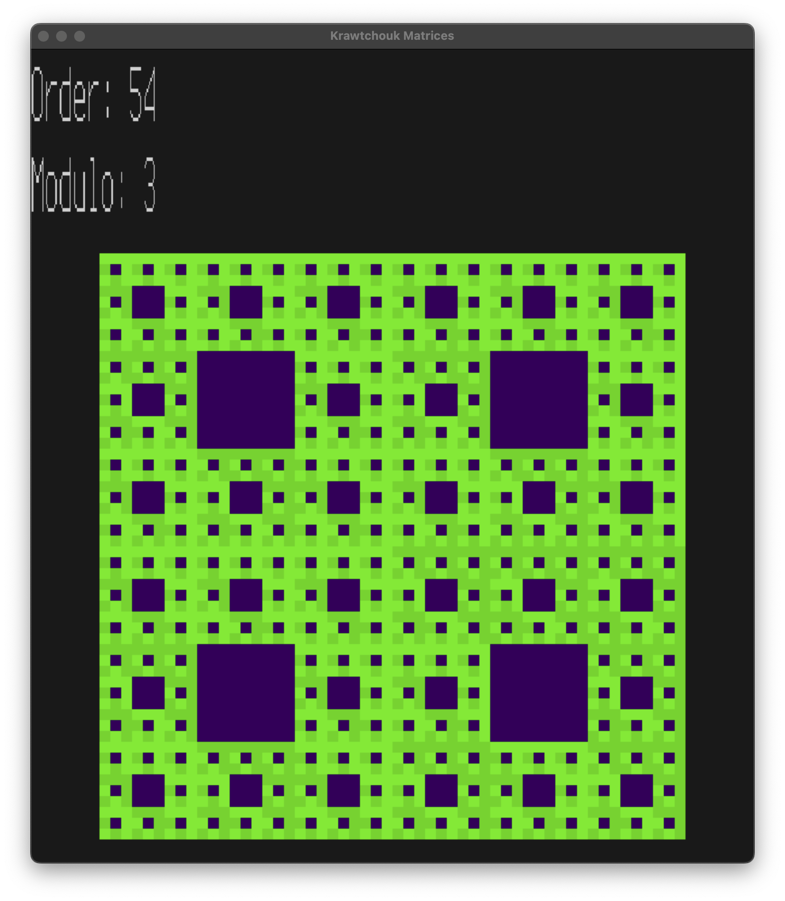
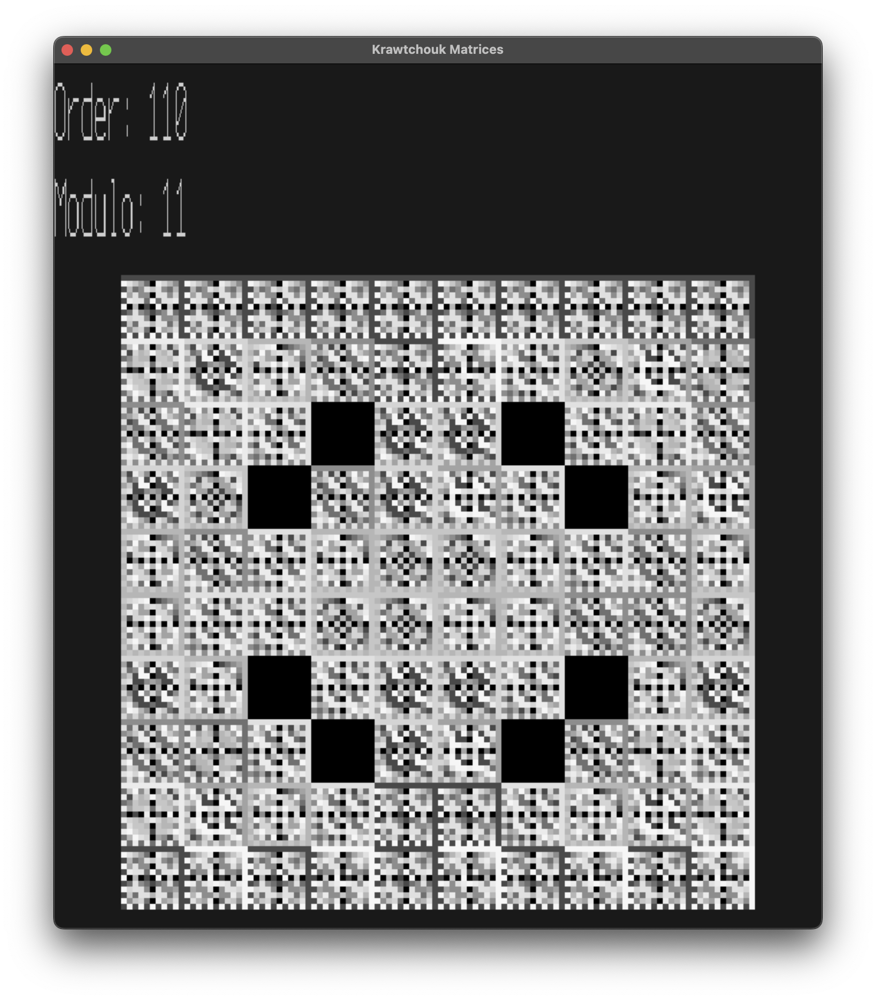
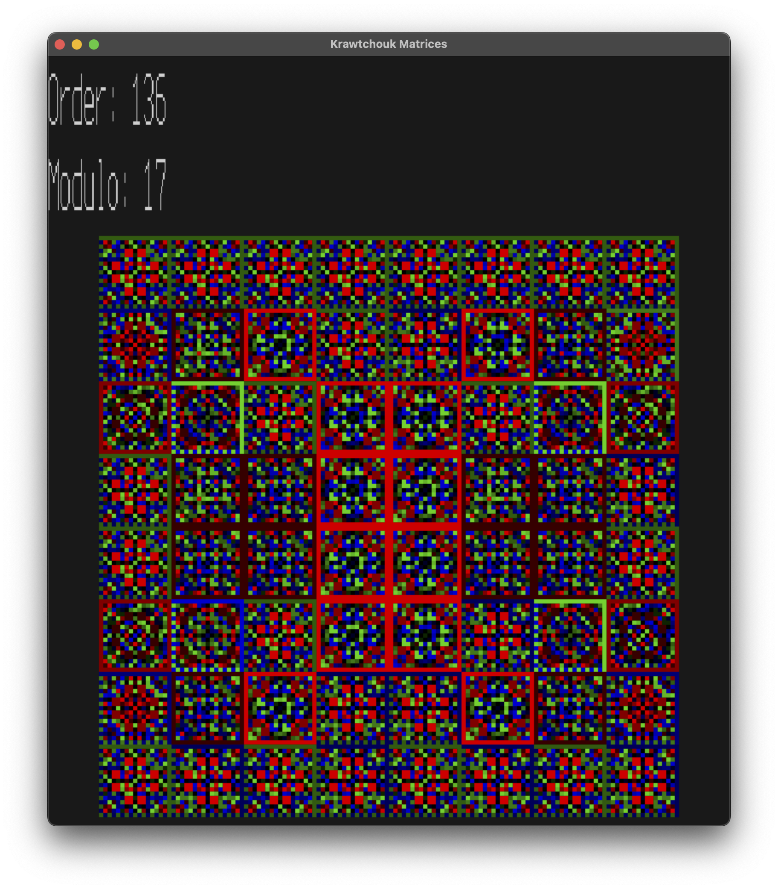

# krview

Kravchuk (or Krawtchouk if you prefer French spelling) matrix viewer visualizes Kravchuk matrices modulo prime numbers. Note that Kravchuk matrices are sometimes called MacWilliams matrices [[1](#references)], [[3](#references)].

This project is inspired by quite old Wolfram Mathematica notebook [[3](#references)]. As a reference one can use [[1](#references)] or [[2](#references)].

## Example

Here is an example of the Kravchuk matrix viewer in action:


## Features

- Visualize Kravchuk matrices modulo prime numbers
- Support for various prime numbers
- Interactive user interface
- Several color schemes to view the data

### Examples of Color Schemes

- Gogin's scheme



- Gray-scale scheme


- logarithmic scheme



- linear hue scheme



### Keybinds

- `Q` exits the application
- `C` changes color scheme
- `W` and `S` or `UP` and `DOWN` change the order
- `A` and `D` or `LEFT` and `RIGHT` change the modulo
- `SHIFT` increases speed of change

## Installation

To install `krview`, clone the repository and build the project:

```sh
git clone https://github.com/supxinfy/krview.git
cd krview
zig build
```
### Dependencies

#### macOS

Install dependencies using Homebrew:

```sh
brew install sdl2 sdl_ttf
```

#### Linux

Install dependencies using your package manager. For example, on Ubuntu:

```sh
sudo apt-get install libsdl2-dev libsdl2-ttf-dev
```

## Usage

Run the application with:

```sh
zig build run
```
or
```sh
zig build
./zig-out/bin/krview
```

Follow the on-screen instructions to visualize Kravchuk matrices.

## License

This project is licensed under the MIT License. See the [LICENSE](LICENSE) file for details.

## References

1. Nikita Gogin and Mika Hirvensalo. Recurrent Construction of MacWilliams and Chebyshev Matrices, TUCS Technical Report, No. 812, February 2007.

2. Philip Feinsilver and Jerzy Kocik. Krawtchouk polynomials and Krawtchouk matrices, Recent Advances in Applied Probability, Springer-Verlag, 2004.

3. N. Gogin, MacWilliams matrix, Mathematica notebook, MathSource, Wolfram Research, 2004. Available at the Wolfram Library Archive: https://library.wolfram.com/infocenter/MathSource/5223/