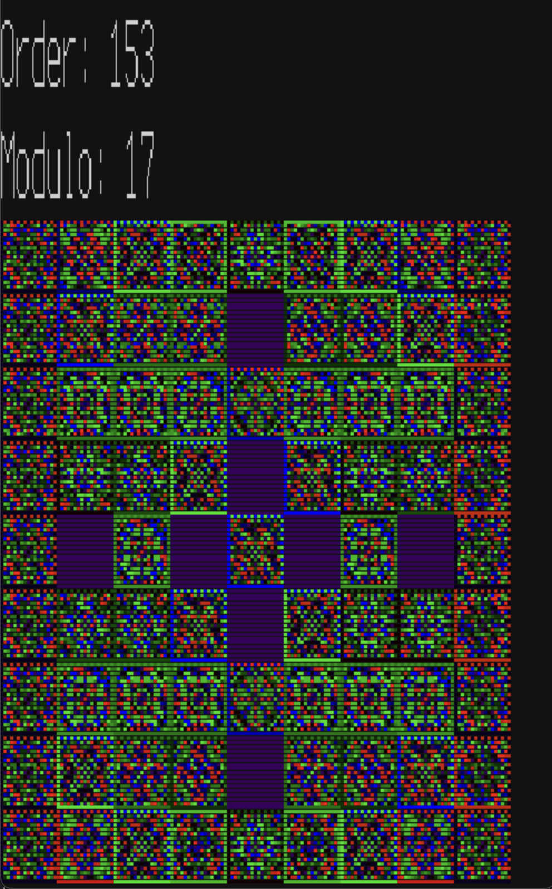

# krview

Kravchuk (or Krawtchouk if you prefer French spelling) matrix viewer visualizes Kravchuk matrices modulo prime numbers. Note that Kravchuk matrices are sometimes called MacWilliams matrices.
## Example

Here is an example of the Kravchuk matrix viewer in action:



## Features

- Visualize Kravchuk matrices modulo prime numbers
- Support for various prime numbers
- Interactive user interface

## Installation

To install `krview`, clone the repository and build the project:

```sh
git clone https://github.com/yourusername/krview.git
cd krview
zig build
```
### Dependencies

#### macOS

Install dependencies using Homebrew:

```sh
brew install sdl2 sdl_ttf
```

#### Linux

Install dependencies using your package manager. For example, on Ubuntu:

```sh
sudo apt-get install libsdl2-dev libsdl2-ttf-dev
```

## Usage

Run the application with:

```sh
zig build run
```

Follow the on-screen instructions to visualize Kravchuk matrices.

## License

This project is licensed under the MIT License. See the [LICENSE](LICENSE) file for details.

